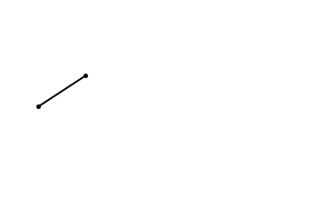
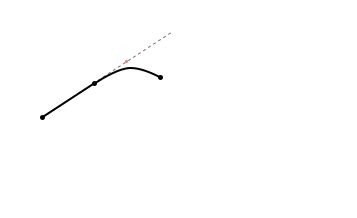
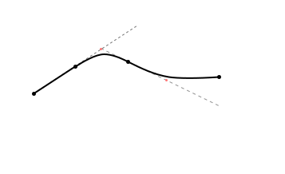
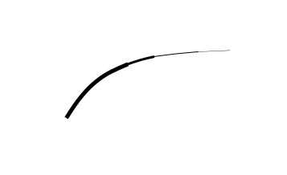

实现三种画笔.和goodnote类似.
## 实现目标
三个画笔:
```javascript
const pen_type = {
    pen: 0,
    brush: 1,
    ballpointpen: 2,
};
```
两种实现方式:
svg和canvas.
## 细节
### 笔的通用配置
```javascript
const pen_option = {
    maxWidth: 5,
    minWidth: .3,
    Curve: "liner",
}
```
## 重要逻辑
### 平滑
前两个点直接连接

<center><font color='#909090' size=2>图1</font></center><br>

第三个点开始:
1. 做前两个点的延长线l
2. 在l上找一点(图中红点)使得它到上一个点与这个点的距离一样.
3. 将红点作为控制点,使用canvas的api连接.
4. 以此类推.实现平滑效果.

<center><font color='#909090' size=2>图2</font></center><br>


<center><font color='#909090' size=2>图3</font></center><br>

### 压力粗细
笔刷移动速度过快的话,会造成这样的锯齿尾梢.因此,可以通过两种办法解决:

对于钢笔笔刷pen:
笔刷移动过快直接将其粗细设置为最小值.
对于画笔笔刷brush:
笔刷移动过快的末梢直接舍弃.
## 代码
基本类结构:
```javascript
class pen {
    constructor() {
        this.penType = pen_type.pen;
    }
    // 设置笔刷类型
    setPenType(pt){
        this.penType = pen_type[pt];
    }
    // 接受压感数据
}
```

