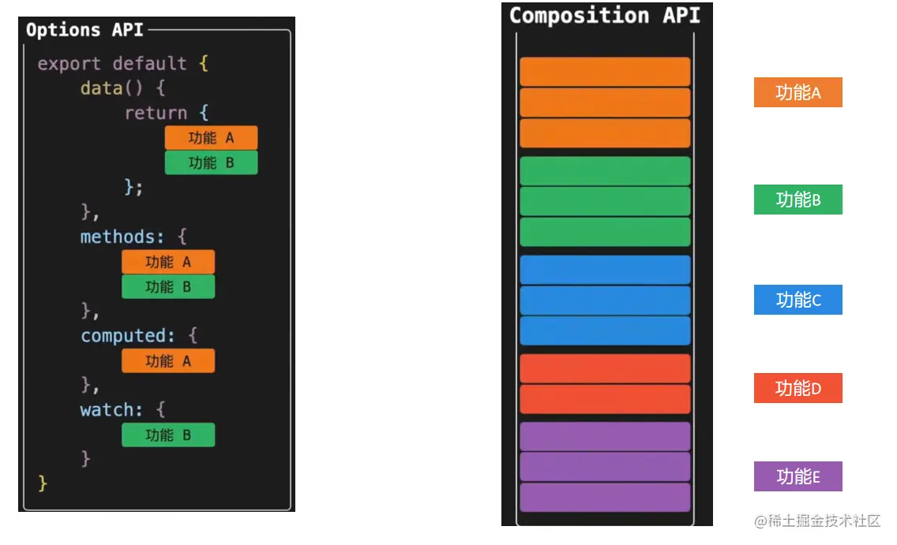

```javascript
<script>
import { ref } from 'vue'

function useShow() {
  const showDivFlag = ref(true)
  function show() {
    showDivFlag.value = true
  }
  function hide() {
    showDivFlag.value = false
  }
  return { showDivFlag, show, hide }
}

function useColor() {
  const fontColor = ref('')
  function changeRed() {
    fontColor.value = 'red'
  }
  function changeBlue() {
    fontColor.value = 'blue'
  }
  return { fontColor, changeRed, changeBlue }
}

export default {
  name: 'App',
  setup() {
    // 功能一
    const { showDivFlag, show, hide } = useShow()
    // 功能二
    const { fontColor, changeRed, changeBlue } = useColor()
    
    return { showDivFlag, show, hide, fontColor, changeRed, changeBlue }
  }
}
</script>

```
